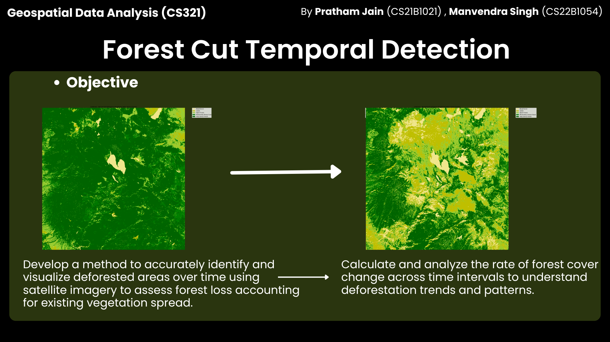
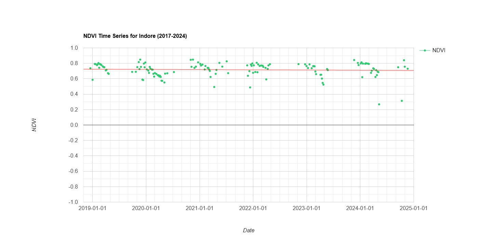
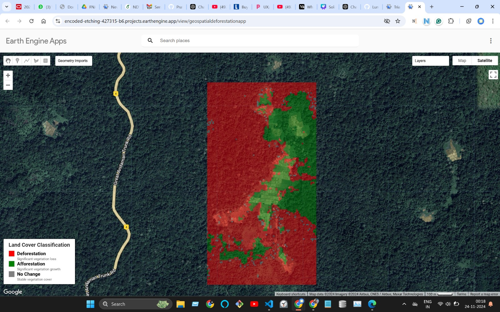
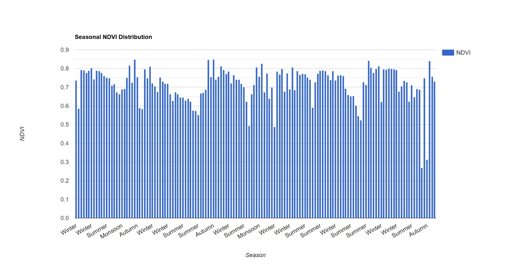
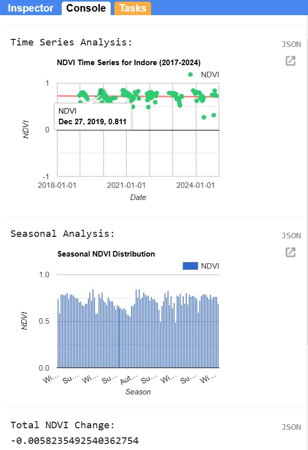

# NDVI Time Series Analysis and Temporal ForestCut Detection

> **Analyze NDVI time series, detect land cover changes, and predict future trends using Google Earth Engine (GEE) and LSTM models.**  
> Scalable to any location globally, demonstrated through a case study of Indore, India.

## Table of Contents
1. [Introduction](#introduction)
2. [Methodology](#methodology)
    - [Study Area and Data Acquisition](#study-area-and-data-acquisition)
    - [Seasonal Analysis](#seasonal-analysis)
    - [ForestCut Detection](#forestcut-detection)
3. [Results](#results)
    - [NDVI Time Series](#ndvi-time-series)
    - [Land Cover Change Classification](#land-cover-change-classification)
4. [LSTM Model for Prediction](#lstm-model-for-prediction)
5. [Applications](#applications)
6. [Limitations](#limitations)
7. [Conclusions](#conclusions)
8. [References](#references)

---

## Introduction

Deforestation, land cover changes, and ForestCut detection are critical global challenges. By leveraging satellite data from **Sentinel-2 Surface Reflectance**, we can analyze vegetation health using the **Normalized Difference Vegetation Index (NDVI)**. This project integrates **Google Earth Engine** for spatial analysis and **LSTM models** to forecast NDVI trends. 

### Key Features:
- Scalable NDVI time series analysis.
- Temporal ForestCut and land cover classification.
- LSTM model for predicting future NDVI trends.

---

## Methodology

### Study Area and Data Acquisition
The study focuses on **Indore, India** (Lat: 22.7196, Long: 75.8788) but is adaptable to any region globally. Data from **2017-2024** was sourced from **COPERNICUS/S2_SR_HARMONIZED** on GEE.  

> **Data Preprocessing**:  
> - Cloud masking using the SCL layer.  
> - NDVI computation as:  
>
>   NDVI = (NIR - RED) / (NIR + RED)

---

### Seasonal Analysis
Seasonal NDVI trends were categorized:  
- **Winter**: December–February  
- **Summer**: March–May  
- **Monsoon**: June–September  
- **Autumn**: October–November  

---

### ForestCut Detection
By analyzing NDVI changes:
- **Deforestation**: NDVI decrease > -0.30  
- **Afforestation**: NDVI increase > 0.30  
- **No Change**: Variation within ±0.20  

---

## Results

### NDVI Time Series
  
Visualization of vegetation health trends from 2017 to 2024.

### Land Cover Change Classification
  
Classification of deforestation (red), afforestation (green), and stable areas (gray).  

### Seasonal NDVI Distribution
  
Comparison of NDVI trends across seasons.

---

## LSTM Model for Prediction

Using **LSTM networks**, future NDVI trends were predicted:
- **Input**: NDVI and temporal features.
- **Output**: Predicted NDVI values.  
- **Metrics**: Mean Squared Error (MSE), Mean Absolute Error (MAE).

### Model Performance

---

## Applications
1. **Deforestation Monitoring**: Early detection and visualization of forest loss.
2. **Vegetation Health Forecasting**: Predictive analysis using LSTM.
3. **Scalable Methodology**: Apply globally via Google Earth Engine.

---

## Limitations
- **Cloud Cover**: Challenges in image availability during monsoons.  
- **Data Quality**: NDVI values depend on accurate atmospheric correction.  
- **Model Limitations**: LSTM accuracy varies with data complexity.  

---

## Conclusions
This project successfully demonstrates:
- Scalable NDVI analysis using Google Earth Engine.
- Predictive capabilities of LSTM models for vegetation monitoring.  
- Insights into deforestation and afforestation trends globally.

---

## References
1. Gorelick, N. et al. (2017). Google Earth Engine: Planetary-scale geospatial analysis for everyone. *Remote Sensing of Environment*, 202, 18-27.  
2. Huete, A. R. et al. (1994). A soil-adjusted vegetation index (SAVI). *Remote Sensing of Environment*, 48(3), 302-313.  
3. Sutskever, I. et al. (2014). Sequence to sequence learning with neural networks. *Advances in Neural Information Processing Systems*, 27, 3104-3112.  

[Full References in `REFERENCES.md`](REFERENCES.md)

---

## Tags
`NDVI` `Google Earth Engine` `LSTM` `Time Series Analysis` `Deforestation` `Remote Sensing` `Python` `Geospatial Analysis`

---

Feel free to replace placeholders (`figures/cover.jpg`, `figures/Img_4.jpg`, etc.) with your actual image paths. Let me know if you'd like further customization! 🚀
